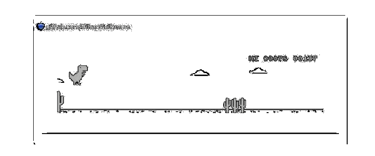

  <h3>Fala Galera, SEJAM BEM-VINDOS AO MEU GITHUB!</h3>
  
Gilvan Guilherme por cá — Desenvolvendo, Aprendendo e Evoluindo Sempre. 
  <strong>Autobots, vamos codar!</strong> 🚀

  

  

    
    
    
    
    
    
    
    
    
  

